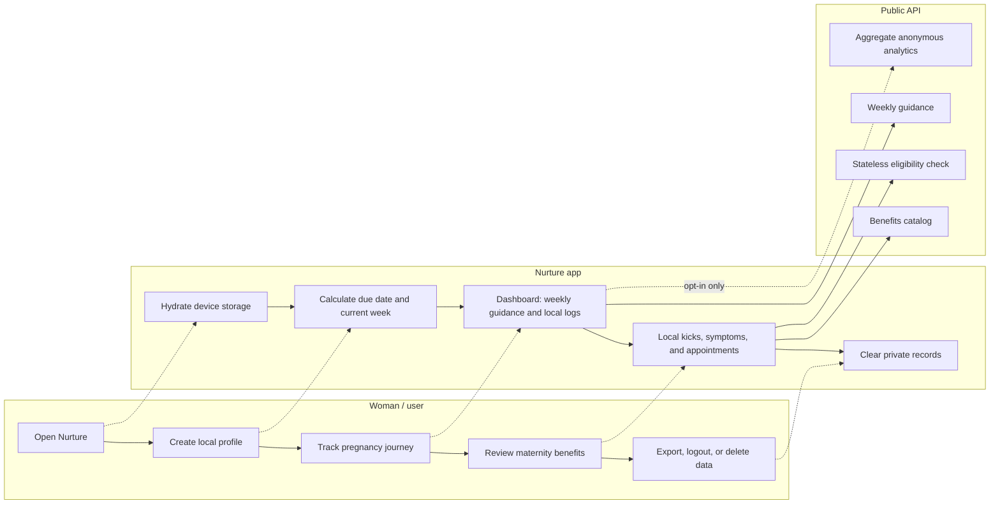
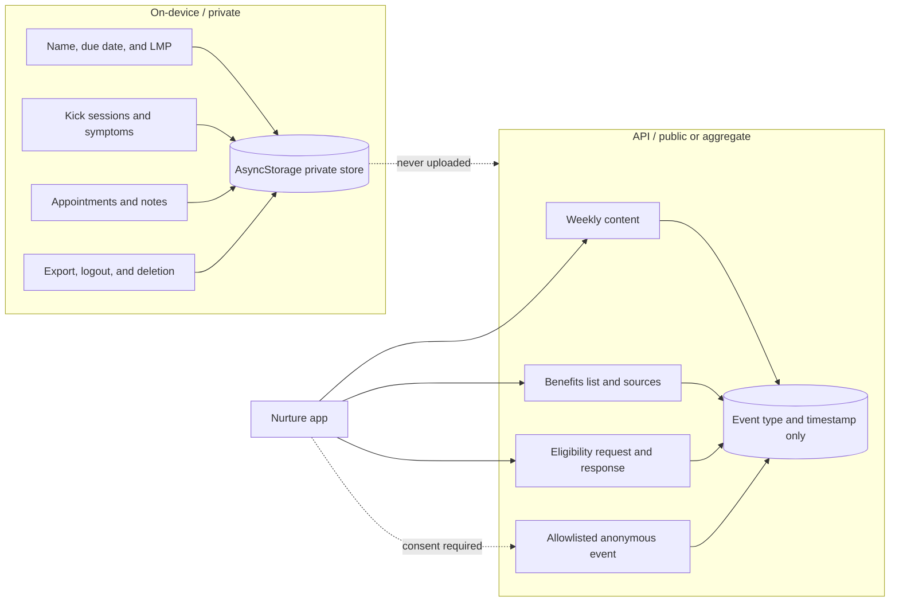
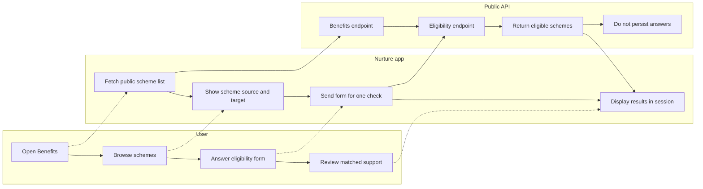
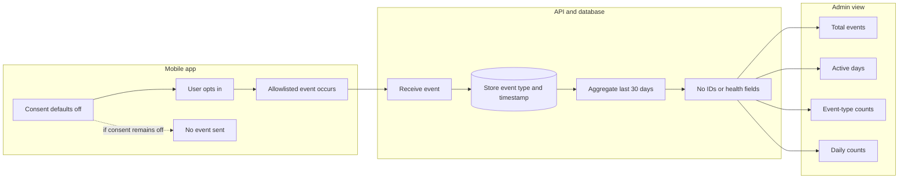

# Nurture Process Flow Diagrams

These diagrams describe the implemented Nurture pregnancy companion flows.
They are intentionally written in Mermaid so they remain editable in GitHub,
Markdown editors, and documentation tools that support Mermaid.

## 1. High-level user journey

## 2. Private data boundary

### Data that must never cross the private boundary

- Profile details
- Due dates or last menstrual period dates
- Kick or symptom records
- Appointment details or notes
- Eligibility answers as a stored user record
- User IDs, install IDs, or other identifiers

## 3. Benefits eligibility flow

Eligibility answers are used to calculate the response and are not stored as
part of the user's private pregnancy profile.

## 4. Anonymous analytics and admin flow

The admin view contains product-level aggregates only. It must not expose
pregnancy, symptom, kick, appointment, profile, or eligibility records.

## Source-of-truth notes

- Private pregnancy and health records are stored locally on the device.
- Weekly content and benefits catalog data are public API-backed content.
- Benefits eligibility checks are stateless.
- Analytics is opt-in, allowlisted, identifier-free, and aggregate-only.
- Admin authentication still requires production security hardening before a
  public launch.